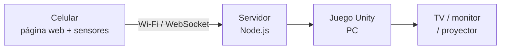

# MoviMente

Minijuegos tipo Wii Play para niños de 8 a 12 años con TDAH. El **celular es el
mando de movimiento** desde el navegador, sin instalar nada: escaneas un QR,
conectas y juegas en la pantalla grande.

**Equipo Kinesis** — Santiago Jesús Callocondo Garay · Piero Douglas Mejía Ramos ·
Misael Josías Marrón Lope



## Minijuegos

| Minijuego | Gesto | Habilidad |
| --- | --- | --- |
| Atrapa lo correcto | Inclinar izquierda/derecha | Atención selectiva |
| Sigue la secuencia | Secuencia de gestos | Memoria de trabajo |
| Corta sin fallar | Swing | Reacción e inhibición |
| Equilibrio *(opcional)* | Mantener estable | Autorregulación y control motor |

## Cómo se ejecuta

Requiere Node.js 20+, Unity 2022 LTS, y PC y celular en la **misma red Wi-Fi**.

```bash
cd server && npm install && npm run dev   # levanta HTTPS + Socket.io e imprime la URL de la LAN
```

Luego se abre el proyecto `unity/` desde Unity Hub y se ejecuta la escena
`MainMenu`. El juego muestra el código y el QR; el celular lo escanea y ya es el
mando.

La primera vez el celular pedirá aceptar el certificado autofirmado: es normal
en red local y es lo que permite al navegador entregar los sensores.

## Documentación

| Documento | Para qué |
| --- | --- |
| [CLAUDE.md](CLAUDE.md) | **Cómo se trabaja aquí.** Empezar por acá |
| [docs/requisitos-y-casos-de-uso.md](docs/requisitos-y-casos-de-uso.md) | Los 20 RF, los 9 RNF y los 9 casos de uso |
| [docs/arquitectura.md](docs/arquitectura.md) | Capas, módulos y decisiones |
| [docs/protocolo-ws.md](docs/protocolo-ws.md) | Contrato de mensajes entre mando, servidor y Unity |
| [docs/equipo-y-responsabilidades.md](docs/equipo-y-responsabilidades.md) | Quién hace qué y quién es dueño de cada carpeta |
| [docs/trazabilidad.md](docs/trazabilidad.md) | Estado de cada requisito |
| [docs/plan-de-pruebas.md](docs/plan-de-pruebas.md) | Pruebas por caso de uso |

## Alcance

MoviMente **no diagnostica ni evalúa el TDAH**. Las métricas que calcula son de
desempeño dentro del juego. No hay cuentas de usuario ni datos personales: los
puntajes se guardan solo en la PC donde se juega.
