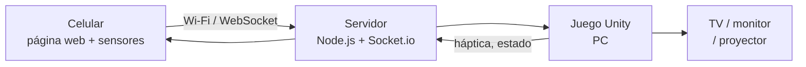
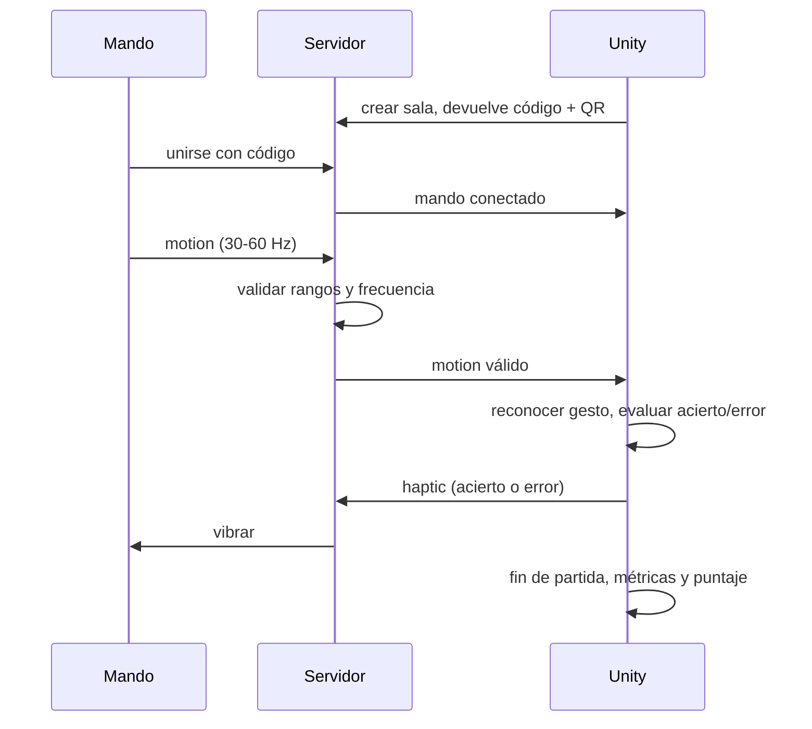

# Arquitectura — MoviMente

## Vista general



Tres procesos, una sola red Wi-Fi local. Nada sale a internet.

## Responsabilidad de cada capa

| Capa | Hace | No hace |
| --- | --- | --- |
| **Mando** (`controller/`) | Pide permiso de sensores, calibra, lee orientación y aceleración, dibuja botones, vibra | No interpreta gestos, no conoce reglas de minijuegos, no puntúa |
| **Servidor** (`server/`) | Crea salas, empareja mando y juego, valida mensajes, retransmite | No interpreta gestos, no guarda partidas, no tiene estado de juego |
| **Unity** (`unity/`) | Reconoce gestos, corre minijuegos, calcula métricas, guarda puntajes, renderiza | No lee sensores directamente: consume el flujo ya validado |

## Módulos internos de Unity

```
unity/Assets/Scripts/
├── Net/          Cliente WebSocket, estado de conexión, pausa por desconexión (RF-07)
├── Gestures/     Calibración y reconocedor de los 5 gestos (RF-05, RF-06)
├── Games/        Un módulo por minijuego (RF-11 a RF-14), sobre una base común
├── Metrics/      Aciertos, errores, omisiones, tiempo de reacción, puntaje (RF-15)
├── Storage/      Mejores puntajes y niveles desbloqueados en la PC (RF-17)
└── UI/           Menús, instrucciones, HUD, resultados (RF-08, RF-10, RF-16)
```

**RNF-08 en concreto:** `Games/` depende de `Gestures/` a través de una interfaz
de eventos (`GestureDetected(tipo, intensidad, timestamp)`). Agregar un minijuego
significa crear una carpeta en `Games/` y registrarlo en el menú; nada más.

## Flujo de una partida (CU-06)



## Decisiones tomadas

| Decisión | Motivo |
| --- | --- |
| WebSocket y no WebRTC | Más simple, suficiente para LAN, menos dependencias |
| El servidor no interpreta gestos | Mantiene un solo lugar donde ajustar umbrales (Unity) y cumple RNF-08 |
| JS vanilla en el mando | La página debe cargar rápido en cualquier celular; no justifica un framework |
| Persistencia local en la PC | RNF-04: sin cuentas ni datos personales |
| HTTPS con certificado local | Los navegadores no entregan sensores en HTTP |

## Riesgos conocidos

- **Certificado autofirmado:** el celular muestra advertencia la primera vez. Hay
  que documentarlo en las instrucciones de la demo.
- **iOS exige gesto del usuario** para pedir permiso de sensores: el botón
  "Activar sensores" es obligatorio (RF-03).
- **Wi-Fi de la universidad** puede aislar clientes entre sí. Plan B: hotspot de
  la laptop o del celular.
- **Deriva del giroscopio:** por eso existe recentrar (RF-05 / CU-07).
