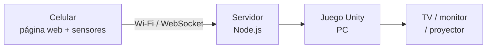
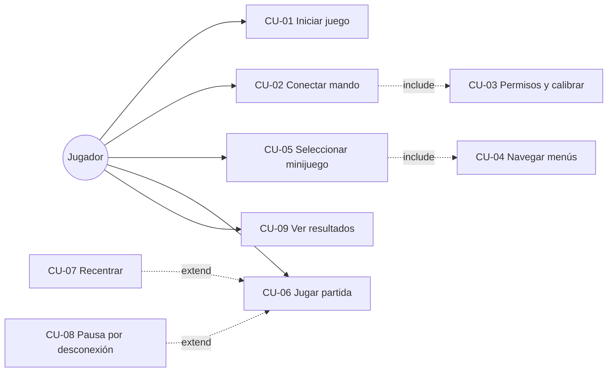

# MoviMente — Requisitos y casos de uso

Sep 22, 2026 · Equipo Kinesis

> Documento fuente. No se modifica sin acuerdo del equipo: es el contrato con el
> curso. Los cambios de alcance se discuten y luego se reflejan aquí.

## Descripción general

MoviMente es una colección de minijuegos tipo Wii Play para niños de 8 a 12 años con TDAH, donde el celular del jugador funciona como mando de movimiento desde el navegador, sin instalar nada.

El juego corre en Unity en una PC conectada a un monitor, TV o proyector. El celular abre una página web que lee sus sensores (acelerómetro y giroscopio) y envía los datos por WebSocket a un servidor, que los retransmite al juego.

El uso es libre: no hay login ni adulto que opere la sesión. El jugador abre el juego, conecta su celular escaneando un QR y juega.

Equipo Kinesis: Santiago Jesús Callocondo Garay, Piero Douglas Mejía Ramos, Misael Josías Marrón Lope.

**Fuera de alcance:** diagnóstico o evaluación clínica del TDAH, cuentas de usuario y almacenamiento de datos personales.

El gesto del jugador viaja del celular al servidor y de ahí al juego, que responde en la pantalla grande.

## Actores

| Actor | Tipo | Descripción |
| --- | --- | --- |
| Jugador | Principal | Abre el juego en la PC, conecta su celular como mando y juega. |
| Servidor de comunicación | Secundario | Empareja el mando con el juego y retransmite los datos de movimiento. |

## Requisitos funcionales

Son 20 requisitos: 18 obligatorios, uno opcional (RF-14) y uno deseable (RF-20).

| ID | Requisito | Prioridad |
| --- | --- | --- |
| RF-01 | Al iniciar, el juego abre una sala y muestra un código y un QR para conectar el mando. | Obligatorio |
| RF-02 | El celular se conecta a la sala escaneando el QR desde el navegador, sin instalar ninguna aplicación. | Obligatorio |
| RF-03 | El mando solicita permiso de acceso a los sensores (obligatorio en iOS) e informa si fue concedido o denegado. | Obligatorio |
| RF-04 | El mando envía en tiempo real la orientación (alpha, beta, gamma) y la aceleración del celular al juego. | Obligatorio |
| RF-05 | El sistema calibra la posición neutra al inicio y permite recentrar el mando en cualquier momento. | Obligatorio |
| RF-06 | El sistema reconoce los gestos: inclinar izquierda/derecha, inclinar adelante/atrás, swing, sacudir y mantener estable. | Obligatorio |
| RF-07 | El juego muestra el estado de conexión del mando; si se pierde la señal, pausa la partida y reconecta automáticamente. | Obligatorio |
| RF-08 | Todos los menús (minijuego, dificultad, pausa, reintentar, salir) se navegan desde el celular: inclinar para moverse y botón en pantalla para confirmar. | Obligatorio |
| RF-09 | El jugador elige un minijuego y un nivel de dificultad (fácil, medio, difícil). | Obligatorio |
| RF-10 | Antes de empezar, cada minijuego muestra instrucciones visuales y por audio con una demostración del gesto. | Obligatorio |
| RF-11 | Minijuego "Atrapa lo correcto": inclinar el celular para mover una canasta y atrapar solo los objetos de la categoría indicada (atención selectiva). | Obligatorio |
| RF-12 | Minijuego "Sigue la secuencia": repetir una secuencia de gestos que crece en cada ronda (memoria de trabajo). | Obligatorio |
| RF-13 | Minijuego "Corta sin fallar": hacer swing para cortar objetos válidos y evitar los prohibidos (reacción e inhibición). | Obligatorio |
| RF-14 | Minijuego "Equilibrio": mantener el celular estable para guiar un objeto por un camino (autorregulación y control motor). | Opcional |
| RF-15 | El sistema calcula por partida aciertos, errores, omisiones, tiempo de reacción promedio, duración y puntaje. | Obligatorio |
| RF-16 | Al terminar la partida se muestra un resumen con puntaje, estrellas y retroalimentación positiva. | Obligatorio |
| RF-17 | El juego guarda localmente en la PC los mejores puntajes y los niveles desbloqueados de cada minijuego. | Obligatorio |
| RF-18 | El mando vibra en aciertos y errores, si el dispositivo lo soporta. | Obligatorio |
| RF-19 | El jugador puede pausar desde el mando y elegir reanudar, reintentar o salir; una partida abandonada no guarda puntaje. | Obligatorio |
| RF-20 | El juego admite dos mandos a la vez para modo cooperativo o por turnos. | Deseable |

## Requisitos no funcionales

| ID | Categoría | Requisito |
| --- | --- | --- |
| RNF-01 | Latencia | Menos de 100 ms entre el gesto y la respuesta en pantalla dentro de la misma red Wi-Fi. |
| RNF-02 | Rendimiento | 60 fps en una laptop promedio; 30 fps como mínimo aceptable. |
| RNF-03 | Compatibilidad | El mando funciona en Chrome para Android y Safari para iOS en versiones recientes. |
| RNF-04 | Seguridad y privacidad | La página del mando se sirve por HTTPS (requisito del navegador para los sensores); sin login ni datos personales, solo puntajes locales. |
| RNF-05 | Usabilidad orientada a TDAH | Partidas de 3 a 5 minutos, una instrucción a la vez, pantallas sin distractores, colores y sonidos no agresivos, refuerzo positivo inmediato y sin penalizaciones humillantes. |
| RNF-06 | Accesibilidad | Instrucciones con texto grande, íconos y audio; el jugador no necesita leer para jugar. |
| RNF-07 | Robustez | Una desconexión no hace perder la partida: se pausa y se retoma al reconectar. |
| RNF-08 | Mantenibilidad | Se pueden agregar minijuegos sin modificar los módulos de conexión ni de reconocimiento de gestos. |
| RNF-09 | Alcance ético | El sistema no diagnostica ni evalúa el TDAH; las métricas son solo de desempeño en el juego. |

## Casos de uso

Nueve casos de uso; CU-02 y CU-06 son los centrales y definen la arquitectura.

| ID | Caso de uso | Actor | Relaciones | Requisitos |
| --- | --- | --- | --- | --- |
| CU-01 | Iniciar juego y abrir sala | Jugador | — | RF-01 |
| CU-02 | Conectar mando | Jugador | Incluye CU-03 | RF-02, RF-04, RF-07 |
| CU-03 | Conceder permisos y calibrar | Jugador | — | RF-03, RF-05 |
| CU-04 | Navegar menús con el mando | Jugador | — | RF-08 |
| CU-05 | Seleccionar minijuego y dificultad | Jugador | Incluye CU-04 | RF-09 |
| CU-06 | Jugar partida | Jugador | Extendido por CU-07 y CU-08 | RF-06, RF-10 a RF-15, RF-18, RF-19 |
| CU-07 | Recentrar mando | Jugador | — | RF-05 |
| CU-08 | Pausar y reanudar por desconexión | Sistema | — | RF-07 |
| CU-09 | Ver resultados y mejores puntajes | Jugador | — | RF-16, RF-17 |

El diagrama resume las relaciones include y extend de la tabla.

### CU-01 Iniciar juego y abrir sala

**Flujo:** el jugador abre el juego en la PC; el sistema crea la sala y muestra el código y el QR.

### CU-02 Conectar mando

**Precondición:** sala abierta.

**Flujo principal:**

1. El jugador escanea el QR.
2. Se abre la página del mando en el navegador del celular.
3. El mando envía el código de sala al servidor.
4. El servidor empareja el mando con el juego.
5. El juego muestra "Mando conectado".
6. Se ejecuta CU-03.

**Flujos alternativos:** código inválido, se muestra error y se pide reescanear; sala llena, se rechaza el mando.

**Postcondición:** mando calibrado y enviando datos.

### CU-03 Conceder permisos y calibrar

**Flujo:** el jugador pulsa "Activar sensores" y concede el permiso; sostiene el celular en posición neutra 2 segundos y el sistema la registra.

**Flujo alternativo:** permiso denegado, el mando explica cómo habilitarlo y no permite continuar.

### CU-04 Navegar menús con el mando

**Flujo:** el jugador inclina el celular para moverse entre opciones y pulsa el botón del mando para confirmar.

### CU-05 Seleccionar minijuego y dificultad

**Flujo:** el jugador elige el minijuego y el nivel mediante CU-04; el sistema carga la partida.

### CU-06 Jugar partida

**Precondición:** mando conectado y calibrado, minijuego seleccionado.

**Flujo principal:**

1. El juego muestra instrucciones y la demostración del gesto.
2. Cuenta regresiva.
3. El juego presenta los estímulos.
4. El mando envía datos continuamente.
5. El reconocedor traduce los datos a gestos.
6. El minijuego evalúa cada gesto como acierto, error u omisión y da retroalimentación visual, sonora y háptica.
7. Al terminar el tiempo o las rondas, se calculan las métricas y se pasa a CU-09.

**Flujos alternativos:** el jugador pausa y elige reanudar, reintentar o salir (si sale, no se guarda puntaje); el control se desalinea, CU-07; se pierde la conexión, CU-08.

### CU-07 Recentrar mando

**Flujo:** el jugador pulsa "Recentrar" en el mando y el sistema toma la posición actual como nueva posición neutra.

### CU-08 Pausar y reanudar por desconexión

**Actor:** sistema.

**Flujo:** al perder la señal del mando, el juego se pausa y muestra un aviso; al reconectarse, retoma la partida desde donde quedó.

### CU-09 Ver resultados y mejores puntajes

**Flujo:** al terminar la partida, el juego muestra el resumen, lo compara con el mejor puntaje guardado y lo actualiza si fue superado.
