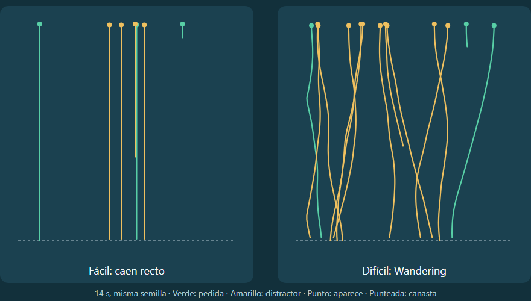

# Técnicas de movimiento — Wandering en Atrapa lo correcto

Nivel: **Atrapa lo correcto (RF-11), dificultad difícil**.
Código: [`unity/Assets/Scripts/Games/AtrapaLoCorrecto/Wandering.cs`](../unity/Assets/Scripts/Games/AtrapaLoCorrecto/Wandering.cs).
Pruebas: [`Tests/WanderingTests.cs`](../unity/Assets/Scripts/Games/AtrapaLoCorrecto/Tests/WanderingTests.cs).

## Qué hace

En fácil y medio los objetos caen recto. En difícil cada objeto **pasea de lado
a lado mientras cae**: cambia de rumbo de forma suave e impredecible, y el
jugador tiene que seguirlo con la canasta en vez de solo esperarlo debajo.

Cada línea es el recorrido real de un objeto calculado por las reglas del juego
(misma semilla en los dos paneles).

## Cómo funciona (Wandering de Reynolds)

En cada cuadro, para cada objeto:

1. **Jitter:** el ángulo de un punto sobre un círculo se corre un poco al azar
   (hasta 40 rad/s).
2. **Círculo adelante:** el círculo se proyecta por delante del objeto, en la
   dirección en que ya se mueve (su velocidad lateral más la caída).
3. **Objetivo:** centro del círculo + el punto del borde. Eso da la velocidad
   lateral deseada, limitada a `WanderSpeed`.
4. **Steering:** la velocidad lateral se acerca a la deseada de a poco
   (`SteeringRate`), así el giro nunca es brusco.
5. **Borde:** si llega al borde del campo rebota, para que siempre se pueda
   atrapar.

Como el círculo va por delante, el objeto tiende a seguir el rumbo que traía, y
el punto que se mueve al azar hace que ese rumbo cambie poco a poco. Por eso el
recorrido es ondulado y sin zigzag.

## Decisiones de diseño

| Decisión | Motivo |
| --- | --- |
| Solo en difícil | En fácil y medio no se agrega movimiento que distraiga (RNF-05). |
| Solo movimiento lateral; la caída sigue a velocidad fija | El jugador tiene el mismo tiempo que sin wandering, y los tiempos de reacción se pueden comparar (RF-15). |
| Velocidad lateral máxima 0,25 (el campo mide 2) | Se nota el paseo, pero el objeto sigue siendo atrapable. |
| Azar con semilla (`System.Random`), no `Time.time` ni Perlin | La misma semilla da la misma partida: se puede probar sin Unity y repetir un caso. |
| Vive en las reglas, no en la escena | La escena solo dibuja `item.X`; el wandering funciona igual en las pruebas y en el juego. |

## Parámetros

| Dónde | Parámetro | Valor |
| --- | --- | --- |
| `AtrapaTuning` | `WanderSpeed` (fácil / medio / difícil) | 0 / 0 / 0,25 |
| `Wandering` | `CircleDistance` | 1 |
| `Wandering` | `CircleRadius` | 0,8 |
| `Wandering` | `JitterRadiansPerSecond` | 40 |
| `Wandering` | `SteeringRate` | 3 |

## Qué verifican las pruebas

- Fácil y medio: los objetos no se mueven de lado.
- Difícil: la mayoría se aleja más de 0,1 de donde apareció, nunca sale del
  campo y nunca salta de lado más de lo que permite `WanderSpeed` en un cuadro.
- Difícil: la caída mantiene su velocidad.
- La misma semilla da exactamente el mismo recorrido.
- Siguiendo al objeto con la canasta, se lo atrapa (acierto).

## Cómo verlo en Unity

Escena `Scenes/Game_AtrapaLoCorrecto` → objeto **Atrapa** → componente
`AtrapaView` → **Difficulty = Hard** → Play.
